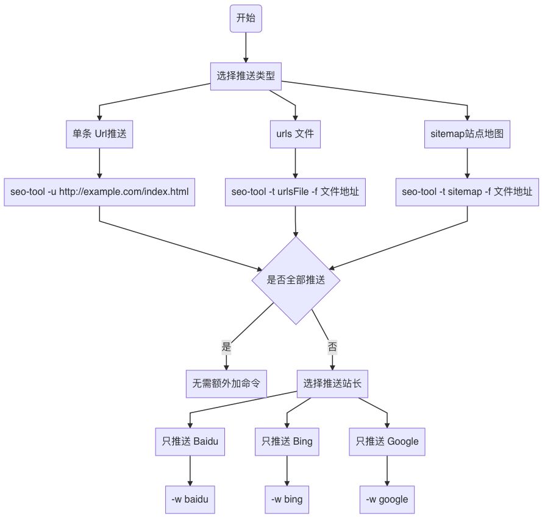

## 快速开始
你可以到 [Release](https://github.com/greycodee/seo-tools/releases/) 下载对应版本对应系统到压缩包，然后解压使用

或者你也可以克隆源代码然后自己编译，这需要有 Go 的编程环境
```shell
git clone https://github.com/greycodee/seo-tools.git && cd seo-tools && go build .
```
编译完成后就可以得到一个二进制程序了

这边示例一下推送一个网址到 baidu 站长上去
> 执行命令前需要将百度站长上得到到 `Token` 设置成 `BING_API_KEY` 环境变量
```shell
./seo-tools -u https://example.com/index.html -w baidu
```
## 环境变量设置
> 各个系统设置环境变量方式有所不同，请查询自己对应系统设置环境变量到方法。密钥申请方法请查看：[百度、谷歌、必应三大站长API密钥申请流程
](http://blog.mjava.top/tool/C334612CBDCE41E79F7EA6A2F3F4C10C/)
```shell
# 站点域名【当要推送 Baidu 或 Bing 时设置】
export SITE_URL=http://blog.mjava.top

# Bing apiKey 配置【当要推送 Bing 时设置】
export BING_API_KEY="xxxxxxx"

# Baidu Token 配置【当要推送 Baidu 时设置】
export BAIDU_TOKEN="xxxxxxx"

# Google 密钥文件路径环境变量【当要推送 Google 时设置】
export GOOGLE_APPLICATION_CREDENTIALS="/xxx/xxx/xxx.json"
```

## 命令使用



### -t 选项
设置推送的类型，默认为 `single`,可选值有：
- single 单条 url 推送
- urlsFile 批量 url 文件推送

  > 文件格式(每一行一个 URL 地址):
  ```text
      http://example.com/index.html
      http://example.com/index.html
      http://example.com/index.html
  ```
- sitemap 站点地图推送
  > 站点地图 XML 格式
  ```xml
    <urlset xmlns="http://www.sitemaps.org/schemas/sitemap/0.9">
      <url>
          <loc>http://blog.mjava.top/gof/gof-singleton/</loc>
          <lastmod>2021-06-15T07:14:24.487Z</lastmod>
      </url>
     </urlset>
  ```

### -u 选项
设置要推送的 url，当 `-t` 选项的值为 `single` 时生效

示例：
```shell
./seo-tools -u https://example.com/test.html
```

### -f 选项
指定要推送当 urls 文件或站点地图文件地址

可以是本地文件或远程文件地址

当 `-t` 选项的值为 `urlsFile` 或 `sitemap` 时生效

示例：
```shell
./seo-tools -t sitemap -f https://example.com/sitemap.xml

# or

./seo-tools -t sitemap -f /root/home/sitemap.xml
```

### -w 选项
> 默认是全部推送

选择要推送当站长，可选项：
- baidu
- bing
- google

示例：
```shell
# 只推送到百度站长
./seo-tools -u https://example.com/test.html -w baidu

# 只推送到必应站长
./seo-tools -u https://example.com/test.html -w bing

# 只推送到谷歌站长
./seo-tools -u https://example.com/test.html -w google
```
